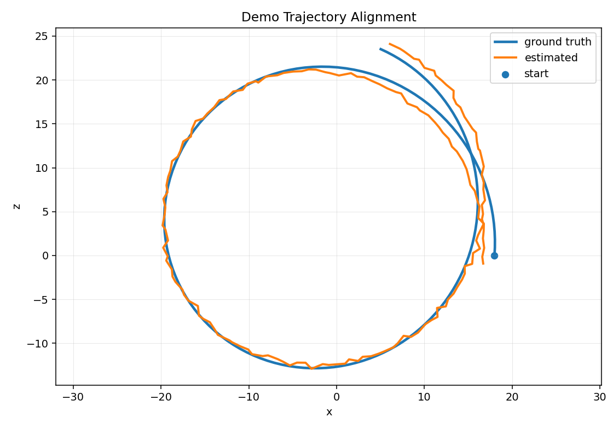
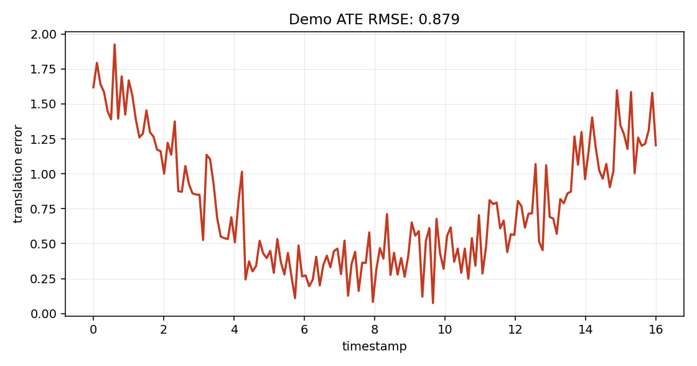

# Visual SLAM Evaluation KITTI/EuRoC

A compact evaluation toolkit for visual odometry and visual SLAM experiments on KITTI and EuRoC-style data. It is intentionally not a new SLAM system: the code focuses on repeatable loading, a lightweight ORB visual odometry baseline, trajectory alignment, ATE/RMSE metrics, and plots that make estimates easy to compare with ground truth.

## Features

- KITTI odometry and EuRoC MAV dataset loaders
- TUM and KITTI trajectory parsing
- ORB feature matching visual odometry baseline
- SE(3) and Sim(3) trajectory alignment with Umeyama
- ATE RMSE and summary statistics
- Estimated vs ground-truth trajectory plots
- Dockerfile for reproducible CLI usage
- Notes for evaluating ORB-SLAM3 outputs without bundling ORB-SLAM3

## Quick Start

```bash
python -m pip install -e .
slam-eval demo --output-dir docs/results
```

Run evaluation for an existing estimate in TUM format:

```bash
slam-eval eval \
  --estimate outputs/orb_vo_tum.txt \
  --ground-truth data/ground_truth_tum.txt \
  --ground-truth-format tum \
  --with-scale \
  --plot-dir outputs
```

Run the ORB baseline on KITTI sequence 00:

```bash
slam-eval orb-vo \
  --dataset kitti \
  --root data/kitti_odometry \
  --sequence 00 \
  --camera image_0 \
  --fx 718.856 --fy 718.856 --cx 607.1928 --cy 185.2157 \
  --image-limit 500 \
  --with-scale
```

## Result Screenshots

The screenshots below are generated by the built-in synthetic demo. They are included so the repository shows the expected output shape even when KITTI or EuRoC data is not checked in.





## What this demonstrates

This project demonstrates the evaluation layer around visual SLAM work: how to load common benchmark folders, produce a simple monocular VO estimate, align trajectories fairly, calculate ATE/RMSE, and generate plots that can be dropped into experiment notes. The ORB VO path is deliberately small so the metric and plotting code remains easy to inspect.

## Dataset Layouts

KITTI odometry:

```text
data/kitti_odometry/
  sequences/00/image_0/*.png
  sequences/00/times.txt
  poses/00.txt
```

EuRoC MAV:

```text
data/euroc/MH_01_easy/
  mav0/cam0/data.csv
  mav0/cam0/data/*.png
  mav0/state_groundtruth_estimate0/data.csv
```

## ORB-SLAM3 Evaluation Notes

ORB-SLAM3 can export estimated trajectories in TUM format. Keep ORB-SLAM3 as a separate dependency, run it with the dataset-specific vocabulary/config, then evaluate its output here:

```bash
slam-eval eval \
  --estimate ORB_SLAM3/CameraTrajectory.txt \
  --ground-truth data/euroc/MH_01_easy/mav0/state_groundtruth_estimate0/data.csv \
  --ground-truth-format euroc \
  --with-scale \
  --max-time-delta 0.01 \
  --plot-dir outputs/orbslam3_mh01
```

Use `--with-scale` for monocular runs. For stereo or RGB-D runs, leave scale fixed unless the exported coordinate frame requires similarity alignment for a specific comparison protocol.

## Docker

```bash
docker build -t slam-eval .
docker run --rm -v "$PWD:/work" -w /work slam-eval demo --output-dir docs/results
```

## Limitations and next steps

- The ORB baseline is a simple monocular VO sanity check, not a robust SLAM implementation.
- Monocular VO has arbitrary scale; use Sim(3) alignment only when that matches the evaluation protocol.
- Dataset calibration parsing is intentionally explicit through CLI intrinsics for now.
- Loop closure, map reuse, relocalization, and full ORB-SLAM3 execution are out of scope.
- Next steps: add calibration-file readers, RPE metrics, evo export helpers, CI with small fixture trajectories, and richer KITTI/EuRoC association tests.
